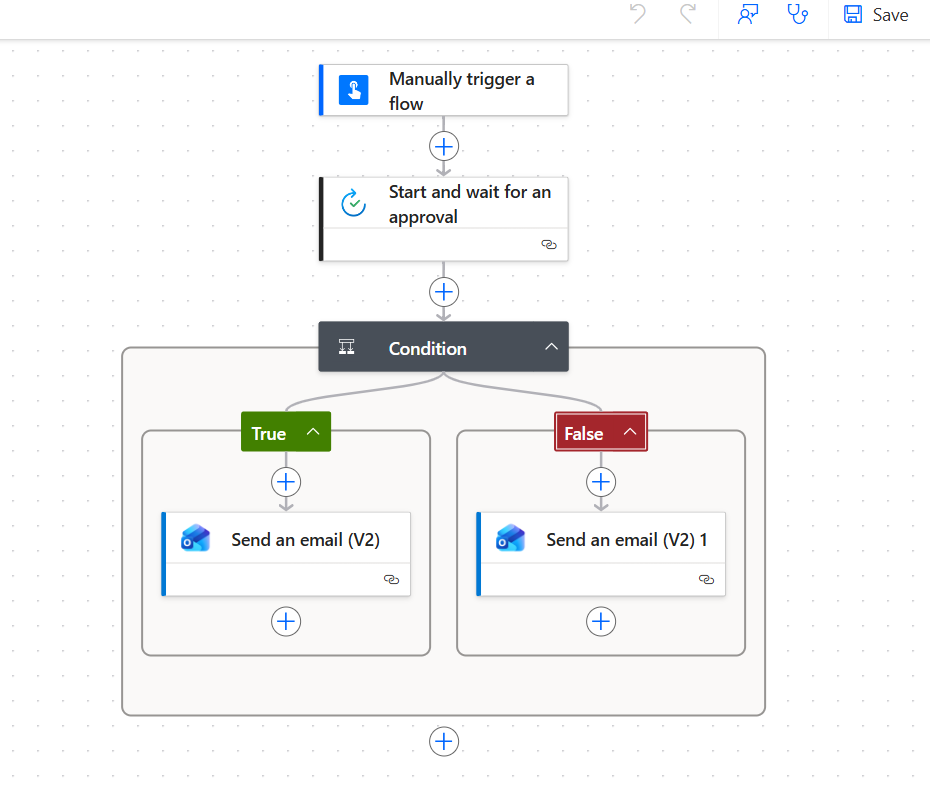
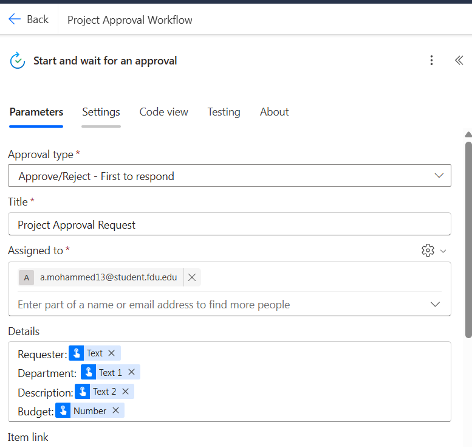
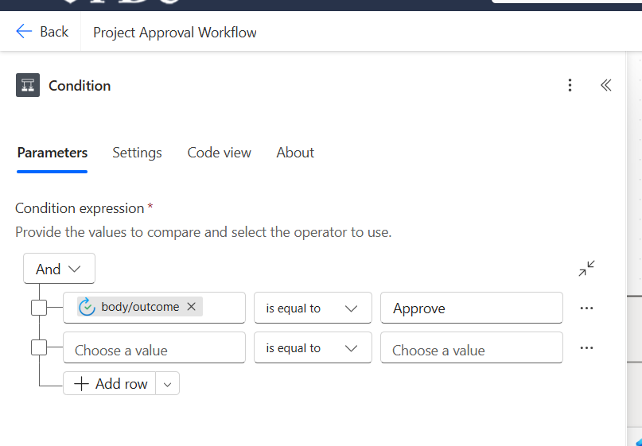
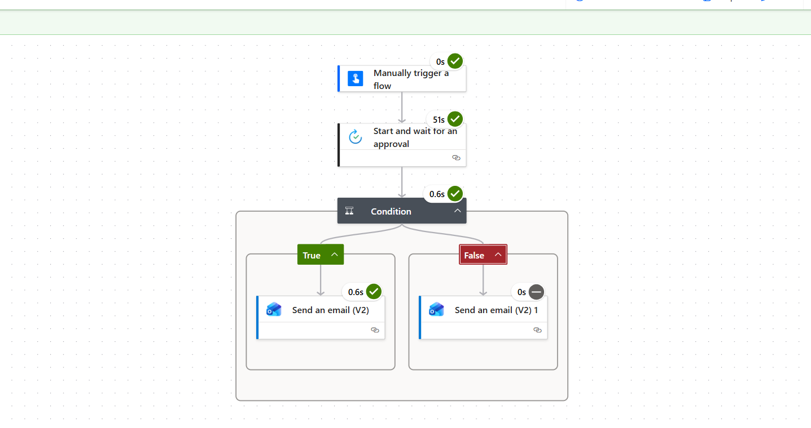

# 📌 Power Automate – Project Approval Workflow

## Overview

This project demonstrates a low-code business process automation workflow built using Microsoft Power Automate within the Microsoft 365 ecosystem.

The workflow automates project approval requests by routing structured inputs through an approval process with conditional logic and automated notifications.

---

## 🏗 Workflow Architecture

Trigger:
- Manually triggered flow with structured inputs:
  - Requester Name
  - Department
  - Project Description
  - Estimated Budget

Processing:
- Microsoft Approvals connector (Approve/Reject – First to respond)
- Conditional branching based on approval outcome

Actions:
- Automated email notifications via Outlook
- Separate handling for Approved and Rejected outcomes

---

## 🔧 Technologies Used

- Microsoft Power Automate
- Microsoft 365
- Approvals Connector
- Outlook Integration
- Conditional Logic Workflows

---

## 🚀 Key Features

- Structured workflow automation
- Approval routing
- Outcome-based conditional branching
- Automated stakeholder notifications
- Low-code process orchestration

---

## 💼 Use Case

Simulates real-world enterprise project approval processing to reduce manual coordination and improve process efficiency.

---

## 🔍 Concepts Demonstrated

- Low-code development
- Business process automation
- Workflow orchestration
- Microsoft 365 integration

---

## 📷 Workflow Screenshots

### 🔹 Workflow Overview
Shows the complete flow structure including trigger, approval step, conditional branching, and notification handling.

---

### 🔹 Approval Configuration
Demonstrates configured approval type, assigned approver, and dynamic field mapping.

---

### 🔹 Conditional Logic
Outcome-based branching using approval response evaluation.

---

### 🔹 Successful Execution
Proof of successful end-to-end workflow execution.

